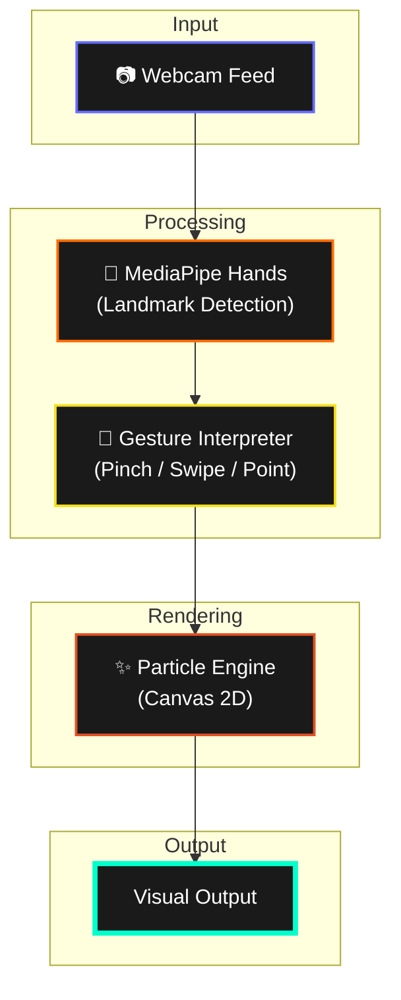

# GestureFlow.js

<div align="center">


[](https://mediapipe.dev/)
[](LICENSE)

[](https://github.com/NirussVn0/GestureFlow.js/stargazers)
[](https://github.com/NirussVn0/GestureFlow.js/network/members)
[](https://github.com/NirussVn0/GestureFlow.js)

</div>

---

> ✋ **Turn your hands into a paintbrush.** GestureFlow.js is an interactive browser-based particle system powered by MediaPipe hand tracking — no plugins, no installs, just your webcam and pure visual magic.

---

## ✨ Features

- 🖐️ **Real-time hand tracking** via MediaPipe Hands (21 landmarks per hand)
- 🌊 **Fluid particle effects** that follow your finger tips and gestures
- 🎨 **Multiple visual modes** — trails, bursts, attractors and more
- 📷 **Webcam-first** — works entirely in the browser, zero backend
- ⚡ **Lightweight** — vanilla JS + Canvas API, no heavy frameworks
- 📱 **Responsive** — adapts to any screen size

---

## 🎬 Demo

<div align="center">


🔗 **[Live Demo →](https://visualniruss.xyz/gestureflow)**

</div>

---

## 🛠️ Tech Stack

### Core
-  **Vanilla JS** — no framework overhead
-  **MediaPipe Hands** — real-time 3D hand landmark detection
-  **Canvas 2D API** — GPU-accelerated rendering

### Tooling
-  **Vite** — blazing fast dev server & bundler
-  **ESLint** — code linting
-  **Prettier** — code formatting

---

## 🚀 Getting Started

### Prerequisites
- A browser with **WebGL + WebRTC support** (Chrome/Edge recommended)
- A **webcam**

### Installation

```bash
# Clone the repo
git clone https://github.com/NirussVn0/GestureFlow.js.git
cd GestureFlow.js

# Install dependencies
npm install
# or with pnpm (recommended)
pnpm install

# Start dev server
pnpm dev
```

Then open `http://localhost:5173` and allow webcam access. ✋

---

## 🧠 How It Works




MediaPipe detects **21 3D keypoints** per hand at ~30fps. GestureFlow maps these landmarks to particle emitters, attractors, and color modes — so your hands literally paint in realtime.

---

## 🎮 Gestures Supported

| Gesture | Effect |
|---|---|
| ☝️ Index finger point | Emit particle trail |
| 🤏 Pinch (thumb + index) | Create burst explosion |
| ✋ Open palm | Attract all particles |
| ✌️ Peace sign | Switch color palette |
| ✊ Fist | Clear canvas |

---

## 🤝 Contributing

Pull requests are welcome! For major changes, please open an issue first to discuss what you'd like to change.

1. Fork the repo
2. Create your feature branch (`git checkout -b feat/cool-effect`)
3. Commit your changes (`git commit -m 'add: cool particle effect'`)
4. Push to the branch (`git push origin feat/cool-effect`)
5. Open a Pull Request 🚀

---

## 👨‍💻 Author

<div align="center">

**NirussVn0** — Love Tech, AI & Creative Coding ✨

[](https://github.com/NirussVn0)
[](mailto:work.niruss.dev@gmail.com)
[](https://melatonin-tech.xyz/)

</div>

---

## 📄 License

This project is licensed under the **GNU Affero General Public License v3.0 (AGPL-3.0)**. See the [LICENSE](LICENSE) file for the full text.

---

<div align="center">

**⭐ Star this repo if it sparked joy (or particles)!**

Made with ❤️ by [NirussVn0](https://github.com/NirussVn0) · 2026

</div>